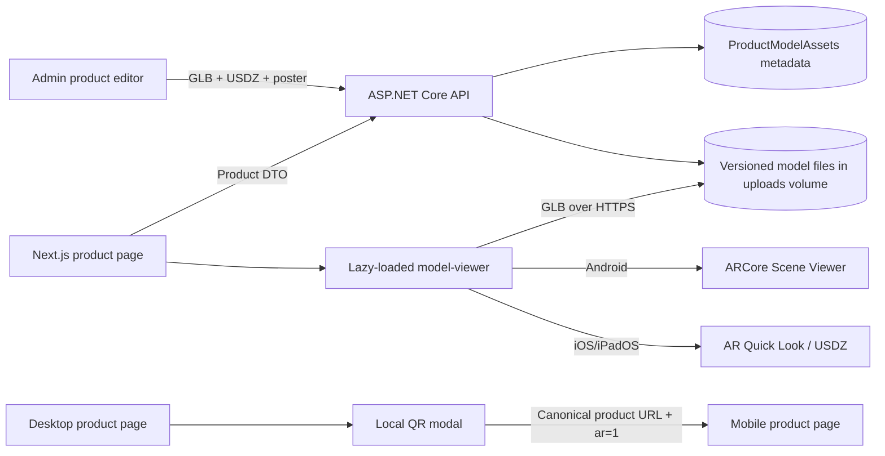

# MERS Tassel 3D Product Viewer & WebAR Implementation Plan

**Status:** Code implemented · asset/device QA pending  
**Target:** Existing Next.js storefront + ASP.NET Core catalog API  
**Primary surface:** Product detail page (`/products/[slug]`)  
**Languages:** English and Turkish  
**Last updated:** 29 August 2026

> **Implementation note:** The plan below is now implemented across the ASP.NET Core API,
> SQLite/PostgreSQL migrations, admin product editor, and Next.js product detail experience.
> The remaining operational step is to upload validated GLB/USDZ assets for each product that
> should expose the viewer.

## 1. Goal

Add an optional, product-specific 3D and augmented-reality experience that lets a customer:

1. Inspect a product in an inline 3D viewer with rotate, zoom, and pan controls.
2. Open native AR on a compatible iPhone/iPad or Android device.
3. Scan a desktop QR code to continue on the same product page on mobile.
4. Continue viewing the interactive 3D model when native AR is unavailable.

The feature must remain invisible for products without a published 3D model. Existing photography, variant selection, cart behavior, SEO, and page performance must continue to work normally.

> **Scope boundary:** Surface-placement AR is not wearable virtual try-on. Rings, earrings, bracelets, and necklaces can be viewed at true scale on a detected surface, but attaching them to a hand, ear, wrist, or neck would require a separate body-tracking/computer-vision project.

## 2. Recommended technical direction

Use Google’s `<model-viewer>` web component through the `@google/model-viewer` package rather than building a custom Three.js renderer.

Why:

- It provides orbit controls, touch gestures, loading events, posters, environment lighting, shadows, and AR launch behavior in one maintained component.
- It supports GLB/glTF for inline 3D and Android Scene Viewer.
- It supports iOS Quick Look with a supplied USDZ asset.
- It can prioritize `webxr`, `scene-viewer`, and `quick-look` and gracefully retain inline 3D.
- It reduces custom WebGL, ARKit, and ARCore integration code and therefore reduces device-specific failure paths.

Use a local QR generator package (`qrcode` plus `@types/qrcode`) so product URLs are never sent to a third-party QR service.

### Proposed dependencies

```text
@google/model-viewer
qrcode
@types/qrcode (development only)
```

Load `@google/model-viewer` only inside the client-side 3D component. Do not include it in the initial bundle for catalog cards or products without 3D assets.

## 3. Current project findings

The existing application already has:

- A server-rendered product route at `client/src/app/products/[slug]/page.tsx`.
- A client product experience at `client/src/components/ProductDetail.tsx`.
- A responsive image gallery and product variant selector.
- Product DTOs and TypeScript types carrying image media, but no 3D fields.
- Admin product editing with multipart JPEG/PNG/WebP uploads.
- ASP.NET Core static media under `/uploads/**`, proxied through the Vercel storefront origin.
- Vercel security headers that currently set `camera=()`. This blocks in-browser WebXR camera access and must be changed deliberately for AR.
- Local media validation that only accepts JPEG, PNG, and WebP and caps uploads at 10 MB. Model uploads require a separate validator and size policy.

## 4. Target architecture



## 5. Product and API data model

Create a separate `ProductModelAsset` entity rather than overloading `ProductMedia`. The current media entity and validator are image-specific; separating models keeps image handling secure and avoids ambiguous MIME behavior.

### Proposed database entity

```text
ProductModelAssets
- Id: int, primary key
- ProductId: int, required, foreign key -> Products
- VariantId: int?, optional foreign key -> ProductVariants
- GlbPath: varchar(500), required
- UsdzPath: varchar(500), optional during draft, required before AR publication
- PosterPath: varchar(500), optional
- Alt: varchar(240), required
- Placement: varchar(16), "floor" or "wall"
- ScaleMode: varchar(16), default "fixed"
- WidthMm: decimal(10,2), required
- HeightMm: decimal(10,2), required
- DepthMm: decimal(10,2), required
- Status: varchar(20), "draft", "ready", or "failed"
- ValidationMessage: varchar(1000), optional
- GlbBytes: bigint
- UsdzBytes: bigint?
- CreatedAt / UpdatedAt / soft-delete fields
```

Constraints:

- Unique `(ProductId, VariantId)` for active records.
- One `VariantId = null` record is the product-level default.
- A selected variant uses its own ready model when present, otherwise the product-level default.
- Only `Status = ready` assets appear in the public DTO.
- All dimensions must be positive and must match the authored model’s real-world bounding box within the agreed tolerance.

### Public DTO addition

```ts
type ProductModelAsset = {
  id: number;
  variantId?: number | null;
  glbPath: string;
  usdzPath?: string | null;
  posterPath?: string | null;
  alt: string;
  placement: 'floor' | 'wall';
  scaleMode: 'fixed';
  dimensionsMm: { width: number; height: number; depth: number };
};

type Product = {
  // existing fields
  modelAssets: ProductModelAsset[];
};
```

### Admin API endpoints

```http
POST   /api/v1/admin/products/{productId}/models
PUT    /api/v1/admin/products/{productId}/models/{modelId}
DELETE /api/v1/admin/products/{productId}/models/{modelId}
```

`POST` and `PUT` use `multipart/form-data`:

```text
glb: File
usdz: File?
poster: File?
variantId: number?
alt: string
placement: floor | wall
scaleMode: fixed
widthMm: number
heightMm: number
depthMm: number
```

Return the updated `ProductDto` so the admin cache and storefront types share one contract.

## 6. Model storage and file structure

Keep binary files out of PostgreSQL. Store only immutable, GUID-based public paths in the database.

```text
api/src/MersTassel.Api/wwwroot/uploads/
└── product-models/
    └── 2026/
        └── 08/
            ├── {guid}.glb
            ├── {guid}.usdz
            └── {guid}.webp
```

Optional source assets used by the 3D artist must not be served publicly:

```text
3d-source/                 # ignored by Git or stored in private asset storage
└── {product-slug}/
    ├── source.blend
    ├── textures/
    └── export-notes.md
```

Production delivery requirements:

- HTTPS only.
- Correct MIME headers:
  - `.glb`: `model/gltf-binary`
  - `.gltf`: `model/gltf+json` if later supported
  - `.usdz`: `model/vnd.usdz+zip`
- `Content-Disposition: inline`.
- Byte-range requests enabled.
- Immutable cache headers for GUID filenames.
- Publicly reachable absolute URLs for Android Scene Viewer and iOS Quick Look.
- Same-origin `/uploads/**` paths remain preferred in the storefront; native AR receives an absolute URL built from the trusted `NEXT_PUBLIC_SITE_URL`, never from an untrusted forwarded host.

### Upload validation

Do not loosen `LocalFileStorageService` image validation. Add a dedicated model storage/validation service.

- GLB:
  - Verify the `glTF` binary magic header.
  - Require glTF version 2.
  - Verify declared file length.
  - Reject unexpected trailing content and malformed chunks.
  - Maximum 15 MB; operational target at or below 10 MB.
- USDZ:
  - Verify ZIP/USDZ structure, not only filename or client MIME.
  - Reject encrypted archives, path traversal, nested archives, and decompression bombs.
  - Require a valid USD scene entry.
  - Maximum 25 MB; operational target as small as visual quality allows.
- Poster:
  - Reuse the existing JPEG/PNG/WebP magic-byte checks.
- Sanitize all output folders, retain GUID filenames, and delete replaced assets only after the database update succeeds.

## 7. Admin product workflow

Add a **3D & AR** section to `ProductEditor` below product photography.

Controls:

1. GLB upload — required for 3D and Android.
2. USDZ upload — required before the model can be published for full iOS AR support.
3. Poster image — recommended; fall back to the product’s primary photograph.
4. Optional finish/variant association.
5. Placement — floor or wall.
6. Real dimensions in millimetres.
7. Alternative text / model description in English and Turkish if desired later.
8. “Validate model” and “Preview 3D” actions.
9. Draft/ready state with clear validation failures.

Admin validation summary should show:

- File size.
- Detected format/version.
- Dimensions entered by the merchant.
- Missing USDZ warning.
- Model optimization warning when the GLB exceeds 10 MB.
- A blocking error when true-scale dimensions are absent.

Publishing an ordinary product must still work without 3D assets.

## 8. Storefront component structure

```text
client/src/components/product-3d/
├── Product3DExperience.tsx     # orchestration and responsive CTA selection
├── ModelViewerCanvas.tsx       # custom-element wrapper and progress events
├── ArAction.tsx                # mobile AR CTA and capability state
├── ArQrDialog.tsx              # desktop QR generation and instructions
├── ArFallbackDialog.tsx        # device/browser-specific recovery guidance
├── ModelLoadingProgress.tsx    # accessible visual progress
├── deviceCapabilities.ts       # platform hints and feature checks
├── modelUrls.ts                # trusted absolute URL construction
└── model-viewer.d.ts           # JSX/custom-element type declarations
```

Existing files to update:

```text
client/src/components/ProductDetail.tsx
client/src/types/commerce.ts
client/src/i18n/I18nProvider.tsx
client/src/app/globals.css
client/vercel.json
client/package.json
client/package-lock.json
api/src/MersTassel.Domain/Entities/Catalog.cs
api/src/MersTassel.Application/DTOs/CatalogDtos.cs
api/src/MersTassel.Application/DTOs/AdminDtos.cs
api/src/MersTassel.Application/Interfaces/Interfaces.cs
api/src/MersTassel.Application/Validation/Validators.cs
api/src/MersTassel.Infrastructure/Data/AppDbContext.cs
api/src/MersTassel.Infrastructure/Data/Configurations.cs
api/src/MersTassel.Infrastructure/Services/CatalogMapping.cs
api/src/MersTassel.Infrastructure/Services/ProductService.cs
api/src/MersTassel.Infrastructure/Storage/*
api/src/MersTassel.Api/Controllers/Admin/AdminProductsController.cs
```

Generate matching SQLite and PostgreSQL EF Core migrations.

## 9. Product page UX

### Products without a ready model

- Render the current photography gallery unchanged.
- Do not download `@google/model-viewer`, a GLB, USDZ, QR library, or AR-specific CSS/logic.

### Products with a ready model

- Add a clear `3D` thumbnail after the product photographs.
- Keep the primary photograph as the initial view for page speed and familiarity.
- Selecting `3D` swaps the large gallery panel to `Product3DExperience` without moving product information or the Add to Bag area.
- Preserve the selected product finish; resolve the closest variant model if available.
- Display a small true-scale dimensions note under the viewer.

### Inline viewer behavior

Recommended `<model-viewer>` configuration:

```html
<model-viewer
  src="...model.glb"
  ios-src="...model.usdz"
  poster="...poster.webp"
  camera-controls
  touch-action="pan-y"
  ar
  ar-modes="webxr scene-viewer quick-look"
  ar-scale="fixed"
  ar-placement="floor"
  shadow-intensity="0.8"
  shadow-softness="0.9"
  environment-image="neutral"
  tone-mapping="aces"
  alt="..."
/>
```

The real implementation must use React props/types and product data rather than hardcoded attributes.

Interaction rules:

- Drag: rotate.
- Pinch/wheel: zoom.
- Two-finger gesture or modified pointer input: pan where supported.
- A visible reset-view control returns to the authored camera orbit.
- Respect `prefers-reduced-motion`; do not auto-rotate for those users.
- Never block page scroll with one-finger vertical movement on mobile.

## 10. Mobile AR flow

1. Show a prominent **View in Your Space (AR)** / **Alanınızda Görün (AR)** button under the viewer.
2. Keep the action user-initiated; browsers will not reliably permit camera/AR launch without a gesture.
3. Configure `<model-viewer>` with both GLB and USDZ URLs and prioritized AR modes.
4. Use capability information to adjust guidance, not as the sole authorization decision:
   - `modelViewer.canActivateAR` when available.
   - WebXR presence and secure-context status.
   - iOS/iPadOS/Safari hints for Quick Look instructions.
   - Android hints for Scene Viewer instructions.
5. Listen for `ar-status` and load/error events.
6. If AR activation fails, open the fallback dialog and keep the inline 3D viewer usable.

### Device behavior matrix

| Environment | Primary action | Asset | Fallback |
| --- | --- | --- | --- |
| iPhone/iPad Safari with AR Quick Look | Open Quick Look | USDZ | Inline GLB + iOS instructions |
| Android Chrome with ARCore | Open WebXR or Scene Viewer | GLB | Inline GLB + ARCore/browser instructions |
| Mobile without native AR | Explain incompatibility | GLB inline | Continue in 3D |
| Desktop | Open QR dialog | Product URL | Continue in inline 3D |

Do not depend only on user-agent parsing. Capability detection is authoritative where the browser exposes it; platform detection only chooses clearer copy.

## 11. Desktop QR fallback

The QR code represents a canonical storefront URL, not a direct model file:

```text
https://www.example.com/products/{slug}?ar=1#product-3d
```

Logic:

1. Build the URL from trusted `NEXT_PUBLIC_SITE_URL` plus the encoded product slug.
2. Generate the QR locally when the desktop dialog opens.
3. Include product name and a short “Open with your phone camera” instruction.
4. Provide a copy-link action and visible plain URL fallback.
5. On mobile, `?ar=1` selects the 3D gallery tab, scrolls it into view, and highlights the AR CTA.
6. Do not auto-launch AR after scanning; require a final user tap for camera permission and native AR activation.

This makes the QR durable, shareable, privacy-preserving, and independent of an external QR-image service.

## 12. Loading, errors, and recovery

### Loading states

- Poster image shown immediately.
- Accessible progress bar driven by `<model-viewer>`’s progress event.
- Percent label for long downloads.
- Indeterminate spinner only before the total progress is known.
- “Preparing 3D view…” and Turkish equivalent announced through `aria-live="polite"`.

### Errors

| Failure | Customer response |
| --- | --- |
| GLB network error | Keep poster visible; show Retry and View photos |
| Invalid model | Hide AR action; show View photos and report telemetry |
| USDZ missing on iOS | Explain that AR is unavailable for this item; retain 3D |
| Camera/AR activation fails | Open device-specific fallback modal |
| Offline | Keep poster and product purchase controls available |
| QR generation fails | Show copyable mobile URL |

The viewer must never prevent Add to Bag, variant selection, product reading, or image viewing.

## 13. True scale, lighting, and model-production standard

Each production model must follow this asset checklist:

- glTF 2.0 binary GLB.
- One unit equals one metre.
- +Y is up; product front faces +Z.
- Origin placed logically at the contact point with the AR surface.
- Real dimensions verified against the physical item.
- PBR materials with realistic roughness and metallic values.
- No baked ground shadow; native AR/viewer supplies the shadow.
- Target 30,000–50,000 triangles; remain below 100,000.
- Prefer no more than 10 materials.
- Texture resolution at or below 2048 × 2048.
- JPEG textures where transparency is not needed; PNG only when needed.
- GLB operational target at or below 10 MB.
- USDZ exported from the approved source and checked separately on iOS.
- Poster uses the same framing as the initial 3D camera to avoid a visual jump.
- Jewellery pieces are tested for visibility at real scale; do not silently exaggerate dimensions.

Use `ar-scale="fixed"` for measurement accuracy. If the business later allows customer scaling for decorative exploration, that must be visibly labelled as non-true-scale and must not replace the fixed-scale purchase view.

## 14. Security, permissions, and privacy

1. Change the Vercel permissions policy from:

   ```text
   camera=(), microphone=(), geolocation=(), payment=(self)
   ```

   to a reviewed policy that allows only this origin to use AR camera/spatial tracking:

   ```text
   camera=(self), xr-spatial-tracking=(self), microphone=(), geolocation=(), payment=(self)
   ```

2. Keep the viewer first-party; do not embed it in a permissive third-party iframe.
3. AR and WebXR require HTTPS in production.
4. Camera frames remain in the browser/native AR viewer and are never uploaded to MERSTassel.
5. Add that privacy statement to the AR fallback/instruction dialog.
6. Keep `X-Content-Type-Options: nosniff` and serve exact model MIME types.
7. Validate file signatures and structure server-side; never trust extension or `Content-Type` alone.
8. Use authenticated, admin-only upload/remove endpoints with rate and size limits.
9. Avoid logging model query strings containing customer identifiers; QR URLs contain only product slug and AR intent.

## 15. Accessibility and localization

- Provide meaningful model alternative text, not “3D model”.
- Make the 3D tab, reset view, AR button, QR dialog, fallback dialog, and retry action keyboard accessible.
- Trap and restore focus in dialogs; close on Escape.
- Announce loading, success, and failure states.
- Maintain visible focus and AA contrast in light and dark themes.
- Respect reduced motion and avoid forced auto-rotation.
- Translate all UI, errors, instructions, dimension labels, and capability guidance into English and Turkish.
- Preserve photography as the accessible non-WebGL alternative.

## 16. Performance budget

- No model-viewer JavaScript on listing pages.
- No model runtime on a PDP without ready model assets.
- Do not fetch the GLB until the 3D tab is selected or is near the viewport and explicitly configured for preload.
- Never preload USDZ; native iOS fetches it only when AR is requested.
- Use a compressed poster under the existing responsive media strategy.
- GLB target: ≤10 MB; hard reject: >15 MB.
- Record model download duration and failure rate before expanding rollout.
- Cache immutable GUID asset URLs for one year and purge by publishing a new GUID, not by mutating an old file.

## 17. Optional analytics events

Add only after the existing analytics/consent layer is ready:

```text
product_3d_opened
product_3d_loaded        { durationMs, bytes, productSlug }
product_3d_failed        { stage, productSlug }
product_ar_clicked       { platform, productSlug }
product_ar_started       { mode, productSlug }
product_ar_failed        { reason, productSlug }
product_ar_qr_opened     { productSlug }
```

These events must respect the customer’s analytics consent. Do not collect camera imagery, room geometry, or raw device identifiers.

## 18. Implementation phases

### Phase 1 — Asset contract and backend foundation

- [x] Add `ProductModelAsset` entity and EF configurations.
- [x] Add SQLite and PostgreSQL migrations.
- [x] Add model DTOs and catalog mapping.
- [x] Implement format-specific model storage and validation.
- [x] Add admin create/update/delete endpoints.
- [x] Configure model MIME types, cache headers, and public HTTPS access.
- [ ] Add integration tests for authorization, validation, replacement, deletion, and DTO exposure.

### Phase 2 — Admin 3D & AR management

- [x] Extend product draft/types and multipart API client.
- [x] Add GLB, USDZ, poster, placement, variant, dimensions, and alt fields.
- [x] Add validation messages and replace/remove controls.
- [x] Prevent “ready” publication when GLB or true-scale dimensions are invalid.
- [x] Confirm ordinary image-only product editing is unchanged.
- [ ] Add an in-editor model preview before saving.

### Phase 3 — Inline storefront 3D viewer

- [x] Install and dynamically load `@google/model-viewer`.
- [x] Add TypeScript custom-element definitions.
- [x] Build viewer, poster, progress, reset, retry, and photo fallback states.
- [x] Add 3D gallery tab only for ready model assets.
- [x] Resolve variant-specific model with product-level fallback.
- [x] Add bilingual labels and responsive styles.

### Phase 4 — Native AR and QR continuation

- [x] Enable `webxr scene-viewer quick-look` modes.
- [x] Pass GLB/USDZ public HTTPS URLs.
- [x] Add mobile AR CTA and `ar-status` failure handling.
- [x] Add desktop QR dialog and trusted canonical URL builder.
- [x] Handle `?ar=1` mobile continuation.
- [x] Update Vercel Permissions-Policy for first-party camera/WebXR.
- [x] Add privacy and device-support guidance.

### Phase 5 — Device QA and controlled rollout

- [ ] Upload one optimized pilot model to a non-featured product.
- [ ] Validate true scale against the physical product.
- [ ] Test the full device/browser matrix.
- [ ] Observe loading and AR failure rates.
- [ ] Fix asset or device-specific issues before enabling more products.
- [ ] Document the repeatable Blender/export/validation process for staff.

## 19. Test plan

### Backend automated tests

- Admin role required for every model mutation.
- Valid GLB accepted; renamed non-GLB rejected.
- Oversized GLB/USDZ rejected.
- Unsafe or malformed USDZ rejected.
- Invalid or missing dimensions rejected.
- Product deletion/soft deletion does not expose stale assets.
- Variant model resolution falls back to product model correctly.
- Public DTO contains ready assets only.
- Replacing an asset retains the old file if the database transaction fails.

### Frontend automated tests

- No 3D UI for image-only products.
- Selecting the 3D thumbnail mounts the viewer lazily.
- Loading progress reaches ready state.
- GLB error retains poster and purchase controls.
- Variant change swaps model when appropriate.
- Desktop renders QR CTA; mobile renders AR CTA.
- QR URL uses the canonical site origin and encoded slug.
- `?ar=1` selects and focuses the 3D experience.
- AR failure opens fallback instructions.
- Reduced-motion mode does not auto-rotate.
- English and Turkish copy are complete.

### Manual device matrix

| Device/browser | Required checks |
| --- | --- |
| Current iPhone Safari | Inline 3D, Quick Look, USDZ scale, return to page |
| Current iPad Safari | Inline 3D, Quick Look, orientation changes |
| ARCore-supported Android Chrome | Inline 3D, WebXR/Scene Viewer, scale, fallback |
| Android without ARCore | Helpful fallback and usable inline 3D |
| macOS Safari/Chrome | Orbit controls, QR generation, scanned continuation |
| Windows Chrome/Edge | Orbit controls, QR generation, scanned continuation |
| Firefox desktop | Inline fallback behavior and no broken purchase flow |
| Slow 3G simulation | Poster, progress, cancel/navigation, retry |

## 20. Acceptance criteria

The feature is ready for general release when:

1. A ready product model can be uploaded, replaced, removed, and previewed from the admin panel.
2. A product without model assets behaves exactly as it did before.
3. A product with assets shows a responsive, keyboard-accessible 3D gallery view.
4. Rotate, zoom, pan, reset, loading progress, retry, and image fallback work.
5. Compatible iOS devices open the product’s USDZ in Quick Look.
6. Compatible Android devices open GLB AR through WebXR or Scene Viewer.
7. Unsupported devices receive clear instructions and retain inline 3D.
8. Desktop QR opens the same product’s mobile AR entry point without an external QR service.
9. Model scale matches the declared physical dimensions and scaling is fixed in AR.
10. Model files are delivered over public HTTPS with correct MIME, range, caching, and security headers.
11. Camera imagery and room data are not stored or transmitted by MERSTassel.
12. The frontend production build, backend tests, SQLite migration, and PostgreSQL migration all pass.

## 21. Risks and mitigations

| Risk | Mitigation |
| --- | --- |
| Jewellery is too small to see comfortably at true scale | Keep fixed scale, provide strong inline zoom, and set honest customer expectations; do not fake AR dimensions |
| Large models hurt mobile conversion | Lazy load, enforce the 10 MB target, use posters, optimize mesh/materials/textures |
| GLB works but USDZ differs visually | Require separate iOS QA for every product asset |
| Browser feature detection is incomplete | Let `<model-viewer>` choose native modes; use detection for guidance and robust failure recovery |
| Vercel header blocks camera/WebXR | Explicitly permit only `self` for camera and `xr-spatial-tracking`, then verify on production HTTPS |
| Scene Viewer cannot fetch a private/internal model URL | Build absolute URLs from the public storefront origin and verify external reachability |
| Model upload expands attack surface | Separate strict validators, size limits, admin authorization, GUID paths, `nosniff`, and safe archive inspection |
| Current local disk storage becomes limiting | Keep storage behind an interface so production can later move models to S3/R2-compatible object storage and CDN |

## 22. Delivery recommendation

Start with one representative product whose geometry and dimensions are easy to verify. Complete the asset pipeline, admin workflow, inline viewer, iOS Quick Look, Android Scene Viewer/WebXR, and desktop QR journey for that product before creating the remaining catalog models. The reusable code can then be enabled product-by-product as approved GLB and USDZ assets become available.

## 23. Technical references

- [`<model-viewer>` API and AR attributes](https://modelviewer.dev/docs/index.html)
- [`<model-viewer>` AR examples and failure events](https://modelviewer.dev/examples/augmentedreality/)
- [Google Scene Viewer requirements and model guidelines](https://developers.google.com/ar/develop/scene-viewer)
- [Apple AR Quick Look documentation](https://developer.apple.com/documentation/arkit/previewing-a-model-with-ar-quick-look)
