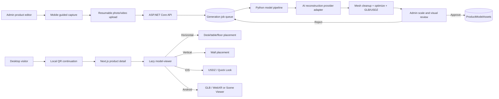

# MERS Tassel AI-Assisted 3D Capture & Real-Scale WebAR Plan

**Status:** Implemented foundation (capture, private jobs, processing adapter, review, and placement)  
**Target:** Next.js storefront, ASP.NET Core catalog API, optional Python model-processing worker  
**Primary customer surface:** `/products/[slug]`  
**Primary admin surface:** Product editor + new mobile capture flow  
**Languages:** English and Turkish  
**Last updated:** 30 August 2026

> Implementation note (31 August 2026): the repository now contains the Phase 1–4 foundation
> and the admin/mobile hand-off described below. The remaining provider and device validation
> steps are intentionally deployment-dependent: add a real Meshy key (or another provider
> adapter), run the processor container, and approve a pilot model before publishing it.

## 1. Outcome

Allow a shopper to open a product on their phone and:

1. Inspect a real-time 3D representation with rotate, zoom, pan, reset, realistic lighting, and loading progress.
2. Tap **View in Your Space (AR)** / **Alanınızda Görün (AR)**.
3. Point the phone camera at a desk, table, floor, or wall.
4. Place the product at its authored physical size before buying.
5. Continue with inline 3D and clear instructions when native AR is unavailable.

Allow the MERS Tassel team to create draft 3D assets from guided phone photos/video with an AI-assisted reconstruction pipeline, validate their scale and appearance, and publish them to the existing product model system.

## 2. Important product distinction

There are two different camera workflows:

### Customer camera: environment placement

The customer camera detects the room and a horizontal or vertical surface. It does **not** generate the product. The already-approved product model is placed into the live camera view.

Customer camera frames and room geometry must remain inside WebXR, ARCore Scene Viewer, or Apple Quick Look. MERS Tassel must not upload or store them.

### Merchant camera: AI-assisted product generation

An administrator photographs or records the real product from many angles. A reconstruction service creates a draft mesh and textures. The draft cannot be published until a person verifies:

- physical dimensions;
- orientation and surface contact point;
- material appearance;
- geometry completeness;
- GLB and USDZ device behavior;
- performance limits.

This review is mandatory because AI/photogrammetry alone cannot guarantee purchase-grade scale or material accuracy.

## 3. Current foundation in this repository

The project already has the core WebAR foundation:

- `ProductModelAsset` domain entity, EF Core mappings, and SQLite/PostgreSQL migrations;
- product-level and variant-level GLB/USDZ metadata;
- admin GLB, USDZ, poster, placement, dimensions, and alt-text controls;
- strict model upload validation and versioned media paths;
- lazy-loaded `@google/model-viewer` on product detail pages;
- inline orbit controls and download progress;
- mobile AR activation using `webxr scene-viewer quick-look`;
- Android GLB and iOS USDZ handling;
- desktop QR continuation to the same product with `?ar=1`;
- AR failure and unsupported-device dialogs;
- Vercel camera and `xr-spatial-tracking` permissions for the same origin;
- bilingual customer UI.

The existing implementation plan remains at:

```text
docs/3d-webar-product-viewer-plan.md
```

This document plans the missing AI capture pipeline and strengthens true-scale desk/wall placement.

## 4. Scope

### Included

- Admin-guided product capture from a mobile browser.
- AI/photogrammetry provider abstraction (Meshy adapter included; credentials are deployment configuration).
- Asynchronous generation jobs and progress.
- Mesh cleanup, optimization, and true-scale GLB export. iOS Quick Look continues to use a manually
  uploaded USDZ when available; `<model-viewer>` can generate a Quick Look representation from
  the approved GLB when no USDZ is stored.
- Mandatory dimension and visual approval.
- Horizontal surface and wall placement modes.
- Existing mobile AR and desktop QR experience.
- Model status, retry, audit, and controlled publication.
- Privacy, security, accessibility, localization, and performance controls.

### Not included in this phase

- Ring-on-finger, bracelet-on-wrist, necklace-on-neck, or earring-on-ear virtual try-on.
- Face, hand, wrist, or body tracking.
- Customer-uploaded room photos.
- Automatic publication of an AI result.
- NeRF or Gaussian-splat-only output that cannot be delivered as a standard GLB/USDZ mesh.
- Claims that every iOS native AR session prevents user scaling.

Wearable try-on is a separate computer-vision feature. This phase provides true-scale surface placement and inline 3D inspection.

## 5. Experience architecture



## 6. Recommended technical direction

Keep Google `<model-viewer>` as the storefront renderer and AR launcher. It already supports:

- GLB/glTF inline viewing;
- `camera-controls` for orbit/zoom/pan;
- `webxr`, `scene-viewer`, and `quick-look` AR modes;
- `ar-placement="floor"` for horizontal surfaces;
- `ar-placement="wall"` for vertical surfaces;
- `ar-scale="fixed"` for supported fixed-scale flows;
- poster, progress, shadows, neutral environment lighting, and load/error events.

Do not replace it with a custom Three.js/WebXR renderer unless a confirmed requirement cannot be met. A custom renderer would add device-specific camera, hit-test, lighting, permission, and native-launch responsibilities.

### AI generation provider boundary

Create a provider-independent interface rather than coupling the API to one commercial service:

```csharp
public interface IProductModelGenerationProvider
{
    Task<GenerationSubmission> SubmitAsync(ModelCapturePackage capture, CancellationToken ct);
    Task<GenerationProgress> GetProgressAsync(string providerJobId, CancellationToken ct);
    Task<GeneratedModelPackage> DownloadResultAsync(string providerJobId, CancellationToken ct);
    Task CancelAsync(string providerJobId, CancellationToken ct);
}
```

The first implementation can use an approved hosted reconstruction provider or a private Python pipeline. Switching provider must not change catalog, admin, or storefront contracts.

## 7. Capture workflow

### Entry point

Add **Create from phone camera** to the admin product editor.

Desktop admins receive a one-time QR code that opens:

```text
/admin/products/{productId}/3d-capture?token={short-lived-token}
```

The token must:

- expire quickly;
- be single-purpose and scoped to one product;
- require an authenticated admin session where possible;
- never grant general product-editing access;
- be invalidated after submission or cancellation.

### Guided capture steps

1. Select product variant/finish.
2. Choose supported placement: horizontal surface, wall, or both.
3. Enter measured width, height, and depth in millimetres.
4. Place a known-size calibration card/ruler beside the product.
5. Capture the lower orbit at approximately 15-degree intervals.
6. Capture a higher orbit and top/bottom detail where safe.
7. Capture close-ups of texture/material details.
8. Review blur, glare, coverage, and missing-angle warnings.
9. Upload the capture package.
10. Track generation progress from the product editor.

### Capture guidance

- Use diffuse, stable lighting and a plain, matte background.
- Keep exposure and focus locked.
- Do not move or deform the product during capture.
- Keep the entire object visible in most frames.
- Prefer 60–120 sharp photographs or a slow guided video that yields equivalent frames.
- Include at least one scale reference and manually measured dimensions.
- Avoid motion blur, hard moving shadows, mirrors, and transparent supports.

### Jewellery limitation

Polished metal, gemstones, glass, pearls, thin chains, and reflective leather hardware are difficult for photogrammetry. For these products:

- use a turntable and diffuse/cross-polarized capture where possible;
- consider a manually modelled or CAD-derived base mesh;
- use AI reconstruction as a draft, not as the final authority;
- compare metal roughness, pearl scale, chain thickness, and stone shape against photography;
- reject topology that merges chain links or invents geometry.

## 8. Generation job data model

Add `ProductModelGenerationJob` without changing the public product DTO until approval.

```text
ProductModelGenerationJobs
- Id: int, primary key
- ProductId: int, required FK
- VariantId: int?, optional FK
- RequestedByUserId: string, required FK
- Provider: varchar(50), required
- ProviderJobId: varchar(200), encrypted/nullable
- CaptureMethod: varchar(20), photos | video | lidar
- CapturePathsJson: text, private paths for the captured images
- CalibrationReferenceMm: decimal(10,2), required
- WidthMm / HeightMm / DepthMm: decimal(10,2), required
- SupportedPlacements: varchar(30), floor | wall | floor,wall
- DefaultPlacement: varchar(10), floor | wall
- Status: varchar(30)
- ProgressPercent: int
- Stage: varchar(80)
- DraftGlbPath / DraftPosterPath: varchar(500), private
- ValidationReportJson: text
- FailureCode / FailureMessage: varchar/text
- ApprovedModelAssetId: int?, FK
- CreatedAt / StartedAt / CompletedAt / ReviewedAt
- ReviewedByUserId: string?
- CaptureTokenHash / CaptureTokenExpiresAt / CaptureTokenUsedAt: short-lived single-use handoff
```

Status state machine:

```text
draft_capture
  -> queued
  -> reconstructing
  -> optimizing
  -> awaiting_review
  -> approved

Any processing state -> failed -> retry_requested -> queued
Any unpublished state -> cancelled
```

Only `approved` jobs may create or replace a public `ProductModelAsset`.

## 9. Placement model

The current asset has one `Placement` value. Extend the admin domain to support:

```ts
type SurfacePlacement = 'floor' | 'wall';

type ProductModelAsset = {
  // existing fields
  supportedPlacements: SurfacePlacement[];
  defaultPlacement: SurfacePlacement;
};
```

Terminology:

- `floor` means any detected horizontal plane, including desk, table, shelf, counter, or floor.
- `wall` means a detected vertical plane.

If both are supported, show a placement selector before AR launch:

- **Place on a surface** / **Yüzeye yerleştir**
- **Place on a wall** / **Duvarda görüntüle**

Update the `<model-viewer>` `ar-placement` attribute before calling `activateAR()`.

Products should not automatically support both modes. Their origin and orientation must be authored for the selected surface. If one model cannot represent both correctly, publish separate placement-specific assets.

## 10. True-scale contract

Real size depends on asset production, not only frontend code.

### Required rules

- GLB uses glTF 2.0 units: one model unit equals one metre.
- Admin dimensions are stored in millimetres.
- Model bounding-box dimensions must match entered dimensions within the publication tolerance.
- The contact point/origin sits on the intended desk/floor plane or against the wall plane.
- `ar-scale="fixed"` is used where the selected AR mode honors fixed scaling.
- Android Scene Viewer launch uses non-resizable behavior when directly configured.
- The initial iOS USDZ scale must be correct.
- UI always displays the verified physical dimensions.

### Honest iOS behavior

Apple Quick Look allows users to move and scale virtual content. Therefore the product can be authored and initially presented at true scale, but the storefront must not claim that every native iOS session makes scaling impossible. Show **True size at 100%** and a reset/scale note where the native experience permits user scaling.

### Publication tolerance

Recommended first-release tolerance:

- dimension mismatch: maximum 2% or 2 mm, whichever is greater;
- origin-to-contact-plane error: maximum 2 mm for small products;
- no negative scale or non-uniform scene-level transform;
- visual review on at least one iOS and one Android device.

## 11. Processing pipeline

The Python worker should process an immutable private capture package:

1. Verify file signatures, dimensions, frame count, and archive safety.
2. Extract usable frames from video when applicable.
3. Remove unusable frames using blur/exposure checks.
4. Submit to the configured reconstruction provider.
5. Download draft mesh and texture results.
6. Remove background/support geometry.
7. Repair normals, holes, disconnected islands, and invalid topology.
8. Calibrate mesh scale using measured dimensions and reference object.
9. Set origin and orientation for the selected placement.
10. Reduce triangles and materials within the mobile budget.
11. Compress/resize textures.
12. Export GLB.
13. Export USDZ from the same approved scene.
14. Render a deterministic poster.
15. Run automated validation.
16. Store private draft outputs and notify the admin reviewer.

Do not treat a NeRF or Gaussian splat as the final deliverable. Native Scene Viewer and Quick Look require portable product assets, so the approved result must be a validated mesh-based GLB and USDZ.

## 12. Automated validation

The validation report must include:

- GLB magic/version/declared length;
- USDZ archive structure and safety;
- public MIME compatibility;
- mesh bounding box versus declared millimetres;
- triangle count;
- material count;
- texture count and maximum resolution;
- missing/broken texture references;
- unsupported glTF extensions;
- invalid transforms, NaN values, and negative scale;
- floor/wall contact alignment;
- file sizes;
- poster availability;
- GLB/USDZ dimension consistency.

Recommended budgets:

| Metric | Target | Blocking maximum |
| --- | ---: | ---: |
| GLB size | ≤ 10 MB | 15 MB |
| USDZ size | As small as practical | 25 MB |
| Triangles | 30k–50k | 100k |
| Materials | ≤ 6 | 10 |
| Texture resolution | ≤ 2048 × 2048 | 2048 × 2048 |

## 13. Admin review UI

Add a **Generated 3D draft** panel to `ProductEditor`:

- job status and progress;
- capture date, variant, and generation provider;
- inline 3D preview;
- side-by-side reference photographs;
- entered dimensions versus detected bounding box;
- desk/wall preview switch;
- GLB and USDZ validation summary;
- warnings for reflective/incomplete geometry;
- Retry, Reject, Download draft, Replace manually, and Approve actions;
- explicit checkbox: “I verified the physical scale against the real product.”

Approval performs one database transaction:

1. Copy/version validated draft assets into public immutable model storage.
2. Create or replace `ProductModelAsset`.
3. Mark the generation job approved with reviewer identity.
4. Invalidate catalog caches.
5. Retain the prior public asset until the transaction succeeds.

## 14. API surface

The implemented routes use the following concrete contract. Capture reads and uploads are
anonymous only when accompanied by the short-lived, single-use token; all job and publication
routes require the administrator JWT.

```http
POST /api/v1/admin/products/{productId}/model-generation-jobs
GET  /api/v1/admin/products/{productId}/model-generation-jobs
GET  /api/v1/admin/model-generation-jobs/{jobId}
POST /api/v1/admin/model-generation-jobs/{jobId}/retry
POST /api/v1/admin/model-generation-jobs/{jobId}/cancel
POST /api/v1/admin/model-generation-jobs/{jobId}/approve
POST /api/v1/admin/model-generation-jobs/{jobId}/reject
GET  /api/v1/model-captures/{jobId}?token={captureToken}
POST /api/v1/model-captures/{jobId} (multipart: token, four-to-twelve images, dimensions, placement)
```

The product editor's **Create from phone** action returns a QR/link. Desktop admins scan it;
admins already on a phone are sent directly to the camera route. Capture requests use the
Next.js same-origin `/api/v1` proxy, so a local `localhost` API value does not resolve to the
phone itself. For a different LAN/public hostname, set `NEXT_PUBLIC_CAPTURE_BASE_URL` to the
URL the phone can open.

Use resumable, chunked upload for large capture packages. Do not proxy a large video through the Vercel frontend. Upload to the API or private object storage using a short-lived signed upload URL.

Example progress response:

```json
{
  "id": 184,
  "status": "optimizing",
  "stage": "Optimizing mobile mesh",
  "progressPercent": 72,
  "canRetry": false,
  "validation": null
}
```

## 15. Storefront component plan

The shipped mobile capture UI is `client/src/components/product-3d/MobileModelCapture.tsx` and
the anonymous route is `/model-capture/[jobId]`. It offers four angle slots, a native camera
button, `capture="environment"` file fallback, measured dimensions, placement selection, upload
progress, bilingual copy, and a private-submission notice. The admin review UI is
`client/src/components/admin/ModelGenerationPanel.tsx`; it polls processing jobs, shows the
validation report, and requires an explicit scale-verification checkbox before publication.

Keep and extend the current structure:

```text
client/src/components/product-3d/
├── Product3DExperience.tsx       # Existing orchestrator
├── SurfacePlacementPicker.tsx    # New desk/wall selection
├── ArFallbackDialog.tsx          # Existing recovery UI
├── ArQrDialog.tsx                # Existing local QR flow
├── deviceCapabilities.ts         # Existing capability hints
├── modelUrls.ts                  # Existing trusted URL builder
├── model-viewer.d.ts             # Existing JSX declarations
└── trueScale.ts                  # New dimensions/scale presentation helpers
```

### Customer flow

1. Product photography remains the initial gallery view.
2. A `3D / AR` thumbnail appears only for an approved model.
3. Selecting it lazy-loads `<model-viewer>` and the GLB.
4. Poster remains visible until the model is ready.
5. Progress and failure recovery never block Add to Bag.
6. Mobile shows **View in Your Space (AR)**.
7. Products supporting both surfaces show the placement picker.
8. Desktop shows **Scan QR Code to View in Room**.
9. The QR opens the canonical product URL with `?ar=1&placement=floor|wall`.
10. The mobile page selects the 3D tab but still requires a user tap to launch AR.

## 16. Device and capability behavior

| Device/browser | Primary behavior | Model | Fallback |
| --- | --- | --- | --- |
| ARCore Android Chrome | WebXR or Scene Viewer | GLB | Inline GLB + instructions |
| Android without ARCore | Inline 3D | GLB | Compatibility guidance |
| iPhone/iPad Safari | Quick Look | USDZ | Inline GLB + iOS guidance |
| Desktop Chrome/Edge/Safari | Inline 3D + QR | GLB | Copy mobile link |
| Unsupported WebGL/browser | Product poster | Image | Photography remains purchasable |

Use capability detection for guidance, not as the only decision. The actual native AR launch result is authoritative.

WebXR requires HTTPS/secure context and user activation. AR launch must always originate from a customer tap.

## 17. Loading and performance

- Do not ship model-viewer JavaScript to category/listing pages.
- Do not mount model-viewer until the customer selects the 3D tab.
- Never download GLB/USDZ for products without approved models.
- Never preload USDZ.
- Use a compressed poster as the immediate visual state.
- Pause model rendering when the viewer leaves the viewport or the tab is hidden where supported.
- Cache GUID-addressed public model files immutably.
- Serve byte ranges, correct MIME types, and HTTPS.
- Cancel progress polling when the admin leaves the editor.
- Use server-sent events only if polling becomes an observed problem; start with bounded polling.

## 18. Security and privacy

- Keep customer camera imagery and room geometry on-device/native.
- Show a short privacy note before AR launch.
- Permit `camera=(self)` and `xr-spatial-tracking=(self)` only on the storefront origin.
- Store merchant capture packages privately and delete raw captures according to a documented retention period.
- Encrypt provider job identifiers and provider credentials.
- Strip EXIF GPS/location metadata from merchant captures before provider submission.
- Require admin authorization for every capture/job/review endpoint.
- Validate archives against traversal, bombs, nested archives, and unsupported content.
- Scan uploads before processing.
- Use signed URLs and short expirations for private capture/draft access.
- Never expose draft assets in public product DTOs.
- Record approval/rejection in an audit log.
- Add provider data-processing terms before sending product captures to a third party.

## 19. Accessibility and localization

- Keep product photography as the non-WebGL alternative.
- Provide descriptive model alt text in English and Turkish.
- Make 3D tab, placement picker, AR CTA, QR dialog, retry, reset, and photo fallback keyboard accessible.
- Announce download progress and errors through `aria-live`.
- Restore focus after closing dialogs.
- Respect reduced motion; no forced auto-rotation.
- Translate desk/wall, true-size, privacy, capability, loading, and error copy.
- Do not rely only on icons or color for status.

## 20. Observability

With analytics consent, record:

```text
product_3d_opened
product_3d_loaded              { productSlug, durationMs, bytes }
product_3d_failed              { productSlug, stage, errorCode }
product_ar_clicked             { productSlug, platform, placement }
product_ar_started             { productSlug, mode, placement }
product_ar_failed              { productSlug, mode, reason }
product_ar_qr_opened           { productSlug, placement }

model_capture_started          { productId, method }
model_capture_uploaded         { productId, bytes, frameCount }
model_generation_completed     { productId, durationMs, provider }
model_generation_failed        { productId, stage, errorCode }
model_generation_approved      { productId, reviewerId }
```

Never record customer camera frames, room meshes, or raw pose data.

## 21. Implementation phases

### Phase 0 — Confirm current baseline

- [ ] Upload and approve one known-good manual GLB/USDZ model.
- [ ] Verify current inline 3D, Android AR, iOS Quick Look, and desktop QR.
- [ ] Measure actual model load time and visual scale.

### Phase 1 — Desk/wall placement upgrade

- [ ] Extend model asset data with supported/default placements.
- [ ] Add the placement picker and query-string continuation.
- [ ] Add placement-specific origin validation.
- [ ] Update English/Turkish UI and admin controls.
- [ ] Test horizontal and vertical placement on physical surfaces.

### Phase 2 — Capture and job backend

- [ ] Add generation-job entity/configuration and both EF migrations.
- [ ] Add private capture storage and signed upload flow.
- [ ] Add short-lived mobile capture token.
- [ ] Add job state machine, authorization, retry, cancellation, and audit.
- [ ] Add provider interface and a fake provider for integration tests.

### Phase 3 — Mobile guided capture

- [ ] Build mobile capture route and camera permission UX.
- [ ] Add frame guidance, angle progress, quality warnings, and review.
- [ ] Require dimensions and calibration reference.
- [ ] Add resumable background-safe upload and recovery.

### Phase 4 — Python processing worker

- [ ] Consume queued jobs idempotently.
- [ ] Integrate the approved reconstruction provider.
- [ ] Normalize scale/origin/orientation.
- [ ] Optimize mesh/materials/textures.
- [ ] Export and validate GLB/USDZ/poster.
- [ ] Return structured progress and failure codes.

### Phase 5 — Admin review and publication

- [ ] Build draft preview and reference-photo comparison.
- [ ] Show automated validation and scale difference.
- [ ] Require human scale approval.
- [ ] Publish atomically to the existing model asset system.
- [ ] Support reject, retry, and manual replacement.

### Phase 6 — Controlled rollout

- [ ] Start with one non-reflective, easy-to-measure item.
- [ ] Add one wall-capable item if the catalog genuinely contains one.
- [ ] Test the complete device matrix.
- [ ] Monitor load and failure metrics.
- [ ] Only then attempt reflective jewellery products.

## 22. Test plan

### Backend

- Unauthorized users cannot create capture tokens or jobs.
- Capture token cannot access another product and cannot be reused.
- Malformed/oversized archives are rejected.
- Job transitions reject invalid state changes.
- Duplicate worker messages do not create duplicate assets.
- Failed processing never replaces the live model.
- Only an approved job creates a public model asset.
- Approval is atomic and audited.
- Public DTO never exposes raw captures, drafts, provider IDs, or failed jobs.

### Frontend/admin

- Capture permissions denied produces recoverable guidance.
- Capture survives a temporary network interruption.
- Dimensions and calibration are mandatory.
- Progress stops polling after completion or unmount.
- Reviewer cannot approve a blocking validation failure.
- Desk/wall selection persists through desktop QR continuation.
- Products with no approved model remain unchanged.

### Manual physical QA

- Measure the real product with calipers/tape.
- Place it in AR beside a ruler or known-size object.
- Compare desk contact and wall alignment.
- Check scale on current iPhone Safari and ARCore Android Chrome.
- Check GLB/USDZ material parity under different lighting.
- Check thin details, reflective areas, and shadows.
- Test slow network, offline recovery, and device rotation.

## 23. Acceptance criteria

1. An admin can start a secure phone capture for a specific product and variant.
2. Capture uploads resume after a temporary connection failure.
3. The job advances through visible, auditable processing states.
4. A failed AI job never affects the live catalog.
5. Admin review shows reference media, true dimensions, and automated validation.
6. Publishing requires explicit human scale verification.
7. Approved output creates valid GLB, USDZ, and poster assets in the existing model system.
8. A shopper can rotate, zoom, pan, reset, and recover from loading errors.
9. Compatible mobile devices can place the item on the supported desk/floor or wall surface.
10. The initial rendered dimensions match the approved physical dimensions within tolerance.
11. Desktop QR opens the same product and requested placement on mobile.
12. Customer camera/room data is never uploaded or stored by MERS Tassel.
13. Products without approved models keep their existing fast photography experience.
14. English and Turkish UI, accessibility, production frontend build, backend tests, and both migrations pass.

## 24. Risks and mitigations

| Risk | Mitigation |
| --- | --- |
| AI reconstruction invents or loses jewellery geometry | Human review, reference comparison, manual/CAD fallback |
| Reflective materials reconstruct poorly | Diffuse/cross-polarized capture, controlled turntable, material re-authoring |
| Generated model has incorrect scale | Calibration object, entered measurements, bounding-box validation, device QA |
| Model is too large for mobile | Automated budgets, mesh/texture optimization, blocking validation |
| GLB and USDZ look different | Export from one approved scene and test both platforms |
| Wall model floats or clips | Placement-specific origin/contact validation |
| Native iOS permits scaling | Correct initial scale, clear 100% size copy, no absolute “locked scale” claim |
| Provider lock-in or outage | Provider adapter, stored capture package, retry/manual upload path |
| Raw captures expose metadata | Private storage, EXIF stripping, retention policy, signed URLs |
| Customer expects wearable try-on | Label surface placement clearly; plan body tracking separately |

## 25. Recommended first product

Pilot with a matte, rigid, non-transparent item with simple geometry and easy measurements—for example a card holder, wallet, small bag, or gift box. Do not begin the AI pipeline with a thin chain, pearl strand, gemstone ring, or highly polished metal product.

After the pipeline is proven, add reflective jewellery using a controlled capture setup and manual cleanup.

## 26. Technical references

- [`<model-viewer>` API: AR modes, placement, and scale](https://modelviewer.dev/docs/index.html)
- [Google Scene Viewer: browser launch, true-scale units, limits, and vertical placement](https://developers.google.com/ar/develop/scene-viewer)
- [Apple: Previewing a model with AR Quick Look](https://developer.apple.com/documentation/arkit/previewing-a-model-with-ar-quick-look)
- [Apple Quick Look format overview](https://developer.apple.com/documentation/QuickLook)
- [W3C WebXR Device API](https://www.w3.org/TR/webxr/)
- [W3C WebXR Augmented Reality Module](https://www.w3.org/TR/webxr-ar-module-1/)
