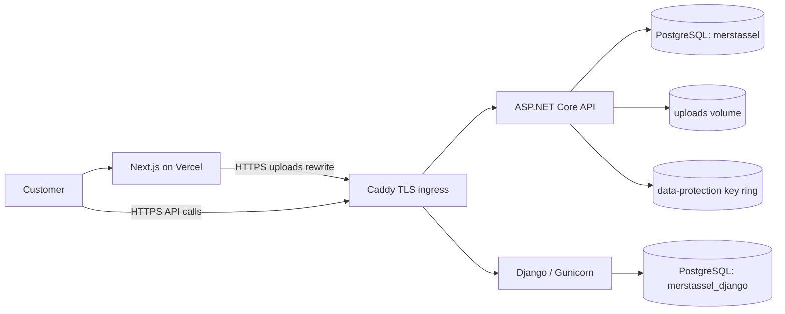

# Production deployment

This runbook deploys the storefront to Vercel and the two backend services to a Linux server.
The browser-facing store uses the ASP.NET Core API. Django remains isolated at a separate legacy
hostname for old administration or API consumers.

## Production topology



## 1. Server and DNS

Use a current Ubuntu LTS server with at least 2 vCPU, 4 GB RAM and 30 GB SSD. Install Docker
Engine with the Compose plugin. In the firewall, allow SSH, TCP 80, TCP 443 and UDP 443. Do not
open ports 5432, 8080 or 8000.

Create these DNS records before starting Caddy:

| Record | Destination |
| --- | --- |
| Root domain and `www` | Vercel, using the values shown in the Vercel domain screen |
| `api.<domain>` | Server public IP |
| `legacy-api.<domain>` | Server public IP |

Caddy obtains certificates automatically after both API records resolve to the server.

## 2. Initialize configuration

Clone the repository on the server, then run:

```bash
cd MERS_Tassel
./deploy/init-production.sh
```

Edit `.env.production` and replace every example domain. `SITE_DOMAIN` is only the hostname,
without `https://`. `VERCEL_PROJECT_DOMAIN` is the stable Vercel project hostname, also without
a scheme.

The initializer creates high-entropy PostgreSQL, JWT, Django and administrator secrets without
printing them. It never overwrites an existing secret. All files under `deploy/secrets/` are
ignored by Git and should have mode `0600`.

Set the Gmail app password, without spaces or quotes:

```bash
nano deploy/secrets/gmail_app_password.txt
```

If Stripe is enabled, place the production values in:

- `deploy/secrets/stripe_secret_key.txt`
- `deploy/secrets/stripe_webhook_secret.txt`

The generated initial admin password is available only on the server:

```bash
cat deploy/secrets/admin_password.txt
```

Store it in a password manager. Never send these files in chat or commit them.

## 3. Build and start the backend

```bash
docker compose --env-file .env.production config --quiet
docker compose --env-file .env.production build --pull
docker compose --env-file .env.production up -d
docker compose --env-file .env.production ps
```

The ASP.NET Core and Django containers wait for PostgreSQL, then apply their own migrations.
The .NET seeder creates the initial catalog and administrator idempotently. Follow startup with:

```bash
docker compose --env-file .env.production logs -f --tail=200 postgres dotnet-api python-api caddy
```

Verify both public endpoints:

```bash
curl --fail "https://api.example.com/health"
curl --fail "https://legacy-api.example.com/health/"
```

Replace the domains in those commands with the configured values.

## 4. Deploy the frontend to Vercel

Import the Git repository into Vercel and set **Root Directory** to `client`. The included
`vercel.json` uses `npm ci` and the production Next.js build.

Add this variable to Vercel Production and Preview environments:

```text
NEXT_PUBLIC_API_URL=https://api.example.com
```

Use the real API hostname and redeploy after changing the variable. Add the root domain and
`www` in Vercel's Domains screen. The exact Vercel production hostname must match
`VERCEL_PROJECT_DOMAIN` in `.env.production`, otherwise the API will reject it through CORS.

The frontend's `/uploads/*` rewrite proxies media through Vercel to the API. Therefore the API
hostname must be reachable publicly during the Vercel build and at request time.

## 5. Stripe and Gmail

Register the production Stripe webhook as:

```text
https://api.example.com/api/v1/payments/stripe/webhook
```

Subscribe to `checkout.session.completed`, `checkout.session.async_payment_succeeded`,
`checkout.session.async_payment_failed` and `checkout.session.expired`.

For Gmail contact delivery, enable two-step verification on `merstassel@gmail.com` and use a
Google app password. The normal account password must never be used.

## Backups

Create a timestamped backup of both databases, both media volumes and the ASP.NET Core
data-protection key ring:

```bash
docker compose --env-file .env.production --profile tools run --rm backup
```

Backups are written under `deploy/backups/<UTC timestamp>/` and older folders are removed after
14 days by default. Copy this directory to separate storage; a backup on the same server is not
a disaster-recovery copy. Test restoration periodically on a staging server.

For a database restore, stop the application containers first, restore the matching `.dump`
with `pg_restore --clean --if-exists`, restore the media and key-ring archives into the named
volumes, and then restart. Always take a fresh backup before a restore.

## Updates and rollback

```bash
git pull --ff-only
docker compose --env-file .env.production build --pull
docker compose --env-file .env.production up -d
docker compose --env-file .env.production ps
```

Migrations run on startup. Take a backup before every deployment. To roll application code back,
checkout the previous known-good commit and rebuild; do not automatically roll database schemas
backward.

## Existing local data

The production stack uses PostgreSQL while local development currently uses SQLite. A fresh
deployment seeds the catalog but does not silently copy local users, orders, newsletters or
contact messages. Keep `api/src/MersTassel.Api/merstassel.db` and the local `wwwroot/uploads`
directory backed up until a one-time data migration has been verified. Do not delete them after
the first deployment.

## Operational checks

```bash
docker compose --env-file .env.production ps
docker compose --env-file .env.production logs --since=30m dotnet-api python-api caddy
docker stats --no-stream
docker system df
```

PostgreSQL and both application ports exist only on internal Docker networks. Caddy is the only
container with host ports, certificates persist in `caddy_data`, the .NET data-protection key
ring persists in `dotnet_keys`, logs rotate automatically, and all application data lives
outside replaceable containers.
